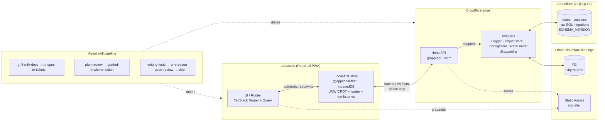

# Agentic Project Template

Working full-stack starter for AI-assisted product development: Cloudflare Workers + React PWA + agent skills.

**Tracer feature:** local-first **Notes** CRUD (create / read / update-via-sync / delete) with D1 sync. Payments are out of scope for this template.

## Purpose

| Goal | How |
|---|---|
| Cheap | Cloudflare free tier |
| Offline-first | LWW merge (`@app/local-first`) + IndexedDB + batched `/v1/sync` |
| Fast | Bundle &lt;200 KB gzip; PWA |
| Agent-ready | Valibot contracts, adapters, ≤300-line files, skill pipeline |
| Quality | Unit, property, BDD, size-limit, security CI |

Docs: [`docs/ARCHITECTURE.md`](docs/ARCHITECTURE.md) · [`AGENTS.md`](AGENTS.md) · [`CONTEXT.md`](CONTEXT.md)

## Stack

| Layer | Choice |
|---|---|
| Edge | Workers + Static Assets + D1 (SQLite) + R2 + Cron |
| API | Hono `/v1/*` |
| Web | React 19 + TanStack Router/Query + Tailwind + PWA |
| Contracts | Valibot (`packages/contracts`) + hono-openapi |
| Sync | `mergeNotes` + leader election + BroadcastChannel |
| Infra | Pluggable adapters — Logger, ObjectStore, ConfigStore, RateLimiter (see [Pluggable infra](#pluggable-infra)) |
| Auth | Anonymous session in D1 (Bearer); cascade delete |
| Tests | Vitest + fast-check + Playwright-BDD |
| Security Checks | Semgrep + OSV-Scanner + gitleaks per PR; ZAP Baseline + Schemathesis on main → staging |

> **Database:** the app talks to **Cloudflare D1** (SQLite-compatible) through the Hono API only — the client never opens a direct DB connection. Migrations are raw SQL in `apps/api/migrations/` (no ORM); the schema is portable to any standard-SQL backend. See [Pluggable infra](#pluggable-infra) for the migration path.

## Setup a new project

```bash
bun install
cp .env.example .env   # or create .env with CF tokens
# edit apps/api/wrangler.toml name + D1/R2 ids if forking
bunx wrangler d1 create <your-db>          # prints a UUID
bunx wrangler r2 bucket create <your-bucket>
bun run db:migrate:local
bunx wrangler d1 migrations apply DB --remote -c apps/api/wrangler.toml   # uses the binding, not the name
bun run check && bun run test && bun run e2e
bun run deploy
```

`.env` (gitignored):

```bash
CLOUDFLARE_ACCOUNT_ID=…
CLOUDFLARE_API_TOKEN=…   # Workers Scripts:Edit, D1:Edit, R2:Edit
```

> **D1 `database_id`:** `wrangler.toml` ships a `replace-me-with-your-d1-uuid`
> sentinel. Replace it with the UUID from `wrangler d1 create` before your
> first remote deploy, or inject the UUID via a CI secret at deploy time
> (wrangler does not interpolate env vars in `wrangler.toml` — substitute
> the value before calling `wrangler deploy`). Local dev uses the
> `preview_database_id` field and is unaffected.

Error tracking is optional and DSN-gated (Sentry free tier). With no DSNs set, the SDKs stay disabled:

```bash
bunx wrangler secret put SENTRY_DSN    # Worker errors (per env)
VITE_SENTRY_DSN=… bun run build        # web errors-only; Session Replay is opt-in
```

### Keep in sync with template updates

Template changes (skills, guardrails, workflows, docs) flow into forked projects via `scripts/template-sync/cli.mjs`. `template-sync.json` declares ownership: **overwrite** paths are template-owned and enforced — `bun run template-gate` (CI) fails on any drift, and syncs always take the template version; **merge** paths (`apps/`, `packages/`, `package.json`, `README.md`, `CONTEXT.md`) merge normally; unlisted paths are project-owned and never synced.

```bash
bun run template-sync init     # add + fetch the upstream remote (once)
bun run template-sync check    # gate: fail on template-owned drift
bun run template-sync update   # merge latest template release (--ref=X to pin)
bun run template-sync finish   # complete a sync after resolving conflicts
```

The `template-sync` workflow (`.github/workflows/template-sync.yml`) opens a sync PR weekly. If it reports conflicts, check out the `template-sync` branch, resolve them, then run `bun run template-sync finish`. To sync from a different upstream URL, set the `TEMPLATE_SYNC_UPSTREAM` environment variable. Do not edit `template-sync.json` in a fork: it is template-owned and the gate will flag any drift.

## Develop a product

```
grill-with-docs → to-spec → to-tickets → plan-review
  → guided-implementation → writing-tests → pr-creation
  → code-review → ship
```

For the full pipeline and when to use each skill, invoke the `agentic-workflow` skill (`.agents/skills/agentic-workflow/SKILL.md`).

Extend **Notes** patterns: contracts in `packages/contracts` → D1 migration + client migration + `SCHEMA_VERSION` → route under `/v1/` → UI route → BDD.

## Pluggable infra

Business logic does not import Cloudflare-specific types or touch environment bindings directly. Every external dependency is hidden behind an adapter interface in `packages/infra` — Logger, ObjectStore, ConfigStore, RateLimiter, the database driver. The template ships a Cloudflare-backed implementation; a project is free to swap any adapter (D1 → Postgres, R2 → S3, Workers → Node, etc.) without rewriting routes, sync, or UI. The monorepo is organised by contract, so the seams are explicit. See `docs/ARCHITECTURE.md` §8 for the full rationale.

## Architecture



**Reading the diagram**

- The **client store is the source of truth**: reads and writes succeed offline; sync is opportunistic, never blocking (`docs/ARCHITECTURE.md` §2).
- The **edge is stateless**: each request carries enough context to merge and persist independently. The client never talks to D1 directly — the API mediates every read and write.
- **Adapters isolate the platform** (`@app/infra`). A new infra layer is a swap of adapter implementations, not a rewrite of business logic.
- The **skill pipeline** drives every change end-to-end, from design to ship. Agents and humans follow the same path.

## Architecture summary

For the full rationale, see [`docs/ARCHITECTURE.md`](docs/ARCHITECTURE.md). The principles in one line each:

- **Cost** — runs on the Cloudflare free tier; static assets are unbilled; client-side compute preferred over server-side.
- **Local-first** — IndexedDB is the source of truth; LWW CRDT with tombstones; leader-elected sync; server-clock floor prevents skew wins.
- **Performance** — initial JS bundle under 200 KB gzipped; route-level code splitting; cache-first Service Worker.
- **Cross-platform** — single codebase reaches web, Android, and iOS as a PWA; `navigator.storage.persist()` defends IndexedDB on iOS.
- **Polished** — responsive, dense, accessible (axe-gated); optimistic interactions; EN + ID locales via the Intl API.
- **Secure** — Valibot validates every external boundary; Bearer sessions in D1; secrets via `wrangler secret`; rate-limited at the edge.
- **Observable** — structured JSON logs with correlation IDs; Cloudflare Analytics + RUM; Sentry is DSN-gated and errors-only.
- **Maintainable** — adapter seams, raw SQL migrations, monorepo by contract; business logic has no Cloudflare-specific imports.
- **Available** — graceful degradation under quota pressure; D1 Time Travel for restore (`docs/RUNBOOK_RESTORE.md`); blocking ZAP + Schemathesis against staging.
- **Reliable** — contracts before code; property tests on the merge; coverage gate > 80%; bundle budget; fuzz and DAST before promotion.
- **Reproducible** — `flake.nix` pins the toolchain; CI runs the same Bun scripts as local dev.
- **Agentic** — files ≤ 300 lines / ≤ 5 direct deps; every dependency has an importer; skill pipeline keeps the work reproducible.

### Commands

| Command | Use |
|---|---|
| `bun run dev` | Build web + wrangler dev |
| `bun run check` | Typecheck |
| `bun run test` | Unit + property + coverage |
| `bun run e2e` | Playwright-BDD |
| `bun run size-limit` | Bundle budget |
| `bun run agentic-limits` | File size / import caps |
| `bun run truth` | No dependency without an importer |
| `bun run deploy` | Production Worker |
| `bun run deploy:staging` | Staging |

## Future plans

- **Payments** (Xendit / Polar) — will be implemented in a follow-up template release behind a single adapter. Until then, consuming projects can wire it in via the `payment-integration` skill; see `AGENTS.md` and `docs/ARCHITECTURE.md` §13.
