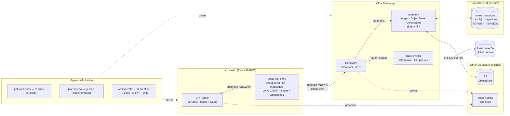

# Agentic Project Template

A working full-stack starter for AI-assisted product development: Cloudflare Workers + React PWA + an agent skill pipeline. It is a real, runnable app built to prove an architecture while giving agents and humans a repeatable path from idea to production. Cloudflare is the shipped example, but every external dependency is a swappable adapter, so moving to other infrastructure is supported by design.

## What it is

A working, runnable foundation for building AI-assisted products: a real app plus a pipeline of instructions that lets an AI agent take a feature from idea to shipped code. It's built around a set of principles, and every principle is enforced by an automated gate in CI. A documented principle without a gate does not exist:

- **Cost:** you can run and scale an app without spending much until you have users paying you.
- **Local-first:** your app works offline, so users keep using it when the network is poor or absent.
- **Performance:** it loads and feels fast even on slow devices and connections.
- **Cross-platform:** one codebase reaches web, Android, and iOS instead of maintaining several.
- **Polished:** the product feels native and accessible, not like a starter skeleton.
- **Secure:** users' data and sessions are protected by default, so you don't ship common vulnerabilities.
- **Observable:** you can see what is failing and why, even before users report it.
- **Maintainable:** you can change and extend the codebase over time without it becoming a mess.
- **Available:** the service keeps working under load and can be restored after failures.
- **Reliable:** changes ship with confidence because tests and checks catch problems early.
- **Reproducible:** anyone on any machine gets the same setup and the same results.
- **Agentic:** AI agents can work on the codebase consistently, which is the whole point of this template.

## Why use it

| Problem it solves | How |
|---|---|
| Cheap to run and scale from zero | Cloudflare free tier; static assets are unbilled |
| Not locked into any vendor | Every external dependency sits behind a swappable adapter in `packages/infra` |
| Works offline, not just online | LWW merge (`@app/local-first`) + IndexedDB + batched `/v1/sync` |
| Fast on slow hardware | Bundle <200 KB gzip; PWA; cache-first service worker |
| Ready for AI agents | Valibot contracts, pluggable adapters, ≤300-line files, skill pipeline |
| Quality you can rely on | Unit, property, BDD, size-limit, security CI, all gated |

The philosophy is documented in [`docs/ARCHITECTURE.md`](docs/ARCHITECTURE.md) and enforced by [`AGENTS.md`](AGENTS.md). See [`CONTEXT.md`](CONTEXT.md) for a mental model of the repo.

## How it works

### The stack

| Layer | Choice |
|---|---|
| Edge | Workers + Static Assets + D1 (SQLite) + R2 + Cron |
| API | Hono `/v1/*` |
| Web | React 19 + TanStack Router/Query + Tailwind + PWA |
| Build | Vite |
| Tooling | Bun · TypeScript · Wrangler |
| Contracts | Valibot (`packages/contracts`) + hono-openapi |
| Sync | `mergeNotes` + leader election + BroadcastChannel |
| Infra | Pluggable adapters: Logger, ObjectStore, ConfigStore |
| Rate limiting | `@app/rate`: Durable Object per key + bounded in-memory fallback |
| Auth | Anonymous session in D1 (Bearer); cascade delete |
| Tests | Vitest + fast-check + Playwright-BDD |
| Security | Semgrep + OSV-Scanner + gitleaks per PR; ZAP + Schemathesis on staging |

### Runtime flow



**Reading the diagram**

- **The client store is the source of truth:** reads and writes succeed offline; sync is opportunistic, never blocking (`docs/ARCHITECTURE.md` §2).
- **The edge is stateless:** each request carries enough context to merge and persist independently. The client never talks to D1 directly, so the API mediates every read and write.
- **Adapters isolate the platform** (`@app/infra`): a new infra layer is a swap of adapter implementations, not a rewrite of business logic.
- **The skill pipeline drives every change** end-to-end, from design to ship. Agents and humans follow the same path.

## The agentic workflow

```
grill-with-docs → to-spec → to-tickets → plan-review
  → guided-implementation → writing-tests → pr-creation
  → code-review → ship
```

For the full pipeline and when to use each skill, invoke the `agentic-workflow` skill (`.agents/skills/agentic-workflow/SKILL.md`). Extend the **Notes** patterns: contracts in `packages/contracts` → D1 migration + client migration + `SCHEMA_VERSION` → route under `/v1/` → UI route → BDD.

## Future plans

- **Payments** (Xendit / Polar): will be implemented in a follow-up template release behind a single adapter. Until then, consuming projects can wire it in via the `payment-integration` skill; see `AGENTS.md` and `docs/ARCHITECTURE.md` §13.

## Learn more

- [`docs/GETTING_STARTED.md`](docs/GETTING_STARTED.md): set up, run, and sync this template
- [`docs/ARCHITECTURE.md`](docs/ARCHITECTURE.md): why the system is built this way
- [`AGENTS.md`](AGENTS.md): guardrails for agents
- [`CONTEXT.md`](CONTEXT.md): mental model of the repo
