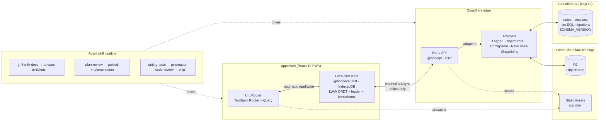

# Agentic Project Template

A working full-stack starter for AI-assisted product development: Cloudflare Workers + React PWA + an agent skill pipeline. It is a real, runnable app — not a toy — built to prove an architecture while giving agents and humans a repeatable path from idea to production.

> **Pluggable infra:** the example runs on Cloudflare, but the platform is swappable by design. Every external dependency (database, object storage, config, logging) sits behind an adapter in `packages/infra`, so moving to other infrastructure — D1 → Postgres, R2 → S3, Workers → Node — means swapping an implementation, not rewriting the app. See `docs/ARCHITECTURE.md` §8.

## What it is

A working, runnable foundation for building AI-assisted products: a real app plus a pipeline of instructions that lets an AI agent take a feature from idea to shipped code. It's built around a set of principles, and every principle is enforced by an automated gate in CI — a documented principle without a gate does not exist:

- **Cost** — runs on the Cloudflare free tier; static assets are unbilled; client-side compute preferred over server-side.
- **Local-first** — IndexedDB is the source of truth; LWW CRDT with tombstones; leader-elected sync; server-clock floor prevents skew wins.
- **Performance** — initial JS bundle under 200 KB gzipped; route-level code splitting; cache-first Service Worker.
- **Cross-platform** — single codebase reaches web, Android, and iOS as a PWA; `navigator.storage.persist()` defends IndexedDB on iOS.
- **Polished** — responsive, dense, accessible (axe-gated); optimistic interactions; EN + ID locales via the Intl API.
- **Secure** — Valibot validates every external boundary; Bearer sessions in D1; secrets via `wrangler secret`; rate-limited at the edge.
- **Observable** — structured JSON logs with correlation IDs; Cloudflare Analytics + RUM; Sentry is DSN-gated and errors-only.
- **Maintainable** — adapter seams, raw SQL migrations, monorepo by contract; business logic has no Cloudflare-specific imports.
- **Available** — graceful degradation under quota pressure; D1 Time Travel for restore (`docs/RUNBOOK_RESTORE.md`); blocking ZAP + Schemathesis against staging.
- **Reliable** — contracts before code; property tests on the merge; coverage gate > 80%; bundle budget; fuzz and DAST before promotion.
- **Reproducible** — `flake.nix` pins the toolchain; CI runs the same Bun scripts as local dev.
- **Agentic** — files ≤ 300 lines / ≤ 5 direct deps; every dependency has an importer; skill pipeline keeps the work reproducible.

## Why use it

| Problem it solves | How |
|---|---|
| Cheap to run and scale from zero | Cloudflare free tier; static assets are unbilled |
| Works offline, not just online | LWW merge (`@app/local-first`) + IndexedDB + batched `/v1/sync` |
| Fast on slow hardware | Bundle <200 KB gzip; PWA; cache-first service worker |
| Ready for AI agents | Valibot contracts, pluggable adapters, ≤300-line files, skill pipeline |
| Quality you can rely on | Unit, property, BDD, size-limit, security CI — all gated |

The philosophy is documented in [`docs/ARCHITECTURE.md`](docs/ARCHITECTURE.md) and enforced by [`AGENTS.md`](AGENTS.md). See [`CONTEXT.md`](CONTEXT.md) for a mental model of the repo.

## How it works

### The stack

| Layer | Choice |
|---|---|
| Edge | Workers + Static Assets + D1 (SQLite) + R2 + Cron |
| API | Hono `/v1/*` |
| Web | React 19 + TanStack Router/Query + Tailwind + PWA |
| Build | Vite |
| Tooling | Bun · TypeScript · Wrangler |
| Contracts | Valibot (`packages/contracts`) + hono-openapi |
| Sync | `mergeNotes` + leader election + BroadcastChannel |
| Infra | Pluggable adapters — Logger, ObjectStore, ConfigStore, RateLimiter |
| Auth | Anonymous session in D1 (Bearer); cascade delete |
| Tests | Vitest + fast-check + Playwright-BDD |
| Security | Semgrep + OSV-Scanner + gitleaks per PR; ZAP + Schemathesis on staging |

### Runtime flow



**Reading the diagram**

- **The client store is the source of truth:** reads and writes succeed offline; sync is opportunistic, never blocking (`docs/ARCHITECTURE.md` §2).
- **The edge is stateless:** each request carries enough context to merge and persist independently. The client never talks to D1 directly — the API mediates every read and write.
- **Adapters isolate the platform** (`@app/infra`): a new infra layer is a swap of adapter implementations, not a rewrite of business logic.
- **The skill pipeline drives every change** end-to-end, from design to ship. Agents and humans follow the same path.

## The agentic workflow

```
grill-with-docs → to-spec → to-tickets → plan-review
  → guided-implementation → writing-tests → pr-creation
  → code-review → ship
```

For the full pipeline and when to use each skill, invoke the `agentic-workflow` skill (`.agents/skills/agentic-workflow/SKILL.md`). Extend the **Notes** patterns: contracts in `packages/contracts` → D1 migration + client migration + `SCHEMA_VERSION` → route under `/v1/` → UI route → BDD.

## Future plans

- **Payments** (Xendit / Polar) — will be implemented in a follow-up template release behind a single adapter. Until then, consuming projects can wire it in via the `payment-integration` skill; see `AGENTS.md` and `docs/ARCHITECTURE.md` §13.

## Learn more

- [`docs/GETTING_STARTED.md`](docs/GETTING_STARTED.md) — set up, run, and sync this template
- [`docs/ARCHITECTURE.md`](docs/ARCHITECTURE.md) — why the system is built this way
- [`AGENTS.md`](AGENTS.md) — guardrails for agents
- [`CONTEXT.md`](CONTEXT.md) — mental model of the repo
